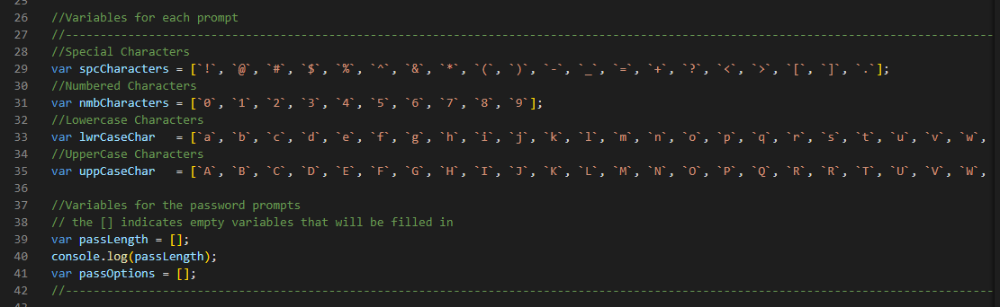
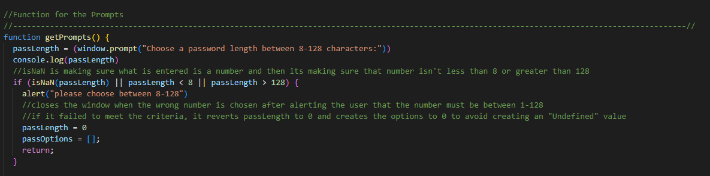
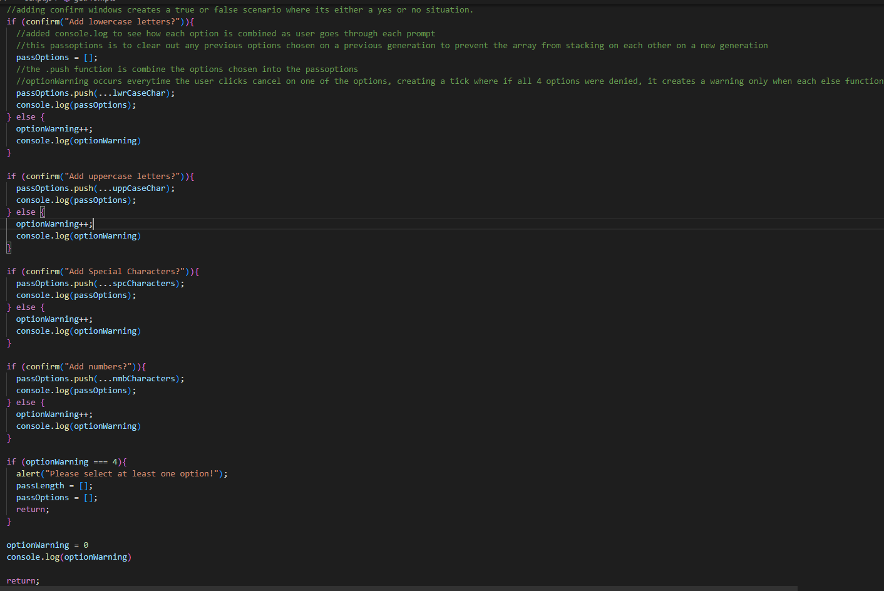
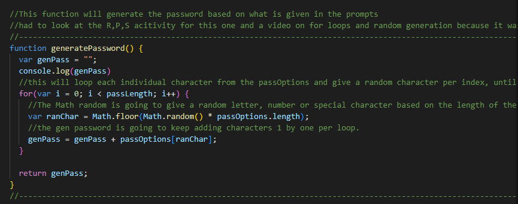
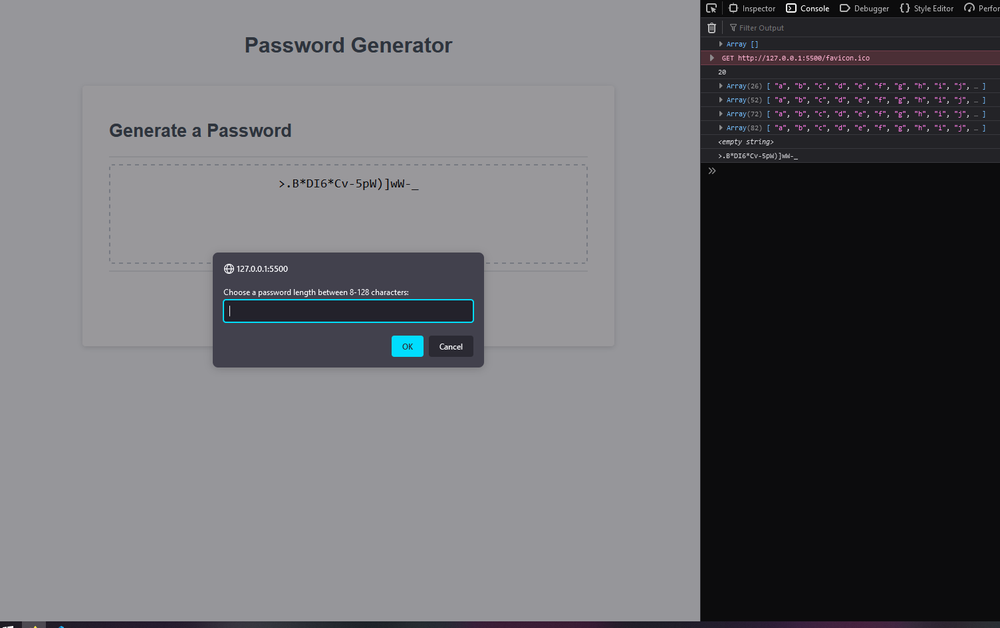

# # 03 JavaScript: Password Generator

## Link to Deployed Project

https://nshaw973.github.io/Challenge-3-Random-Password-Generator/

## How to Use

Click on the Generate Password button.
When prompted, choose a password length between 8 - 128.
a new prompt will appear asking if you would like lowercase letters, choose either based on personal taste.
Then you'll be asked for uppercase.
Then for Special Characters.
Lastly for numbers. 
Generated Password will within empty box


## Your Task

In this Challenge I was tasked to add ontop of the starter code and create a working Password Generator that will list various 
prompts asking for the length, upper/lowercase letters, special characters, and numbers.


## Challenges

With the starter code giving me an event listener that checked for when the "Generate Password" button had been clicked.
Query Selectors were also given in the starter code to select the elements that were going to be modified once the password was generated and injected into the HTML.

First thing, I started to work on was getting the variables set up for the characters that are going to be used for the password generation.



Afterwards it was time to work on the Window prompts. The hardest part about this was making sure when the user typed a number in, it didn't continue 
the prompts when random letters had been entered, only when a number has been typed.

Even though when a number was typed it came out through the console.log as a string. the if check allowed the number to pass as long it passed through
the checks on whether or not the string was within 8-128.

In order to avoid anything but numbers through, the IsNaN() function was added to make sure that anything but a number was acceptable.
If it failed to meet any of the requirements, it would then alert the user that whatever was entered wasn't a number between 8-128, only to 
then reset the length to 0 and options to none, in orde to prevent an error where undefined kept on popping up with the length of an undesired number entered.
Lastly the return was entered in to prevent any more prompts from appearing and to restart the prompts from the top after pressing the button again.
The rest didn't involve any input from the user other than a true or false statement.




This contains the prompts the user is given when asked for Letters, Characters, and numbers.
As well as the checks that happen if user decides to click cancel on all the Prompts besides the length which has it's own alert.





Last bit of code needed was creating the randomly generated password based on what the user had given.
The generatePassword(); Function was missing after it was given in the initial starter code.

Started off with an empty Variable of genPass, which is going to be filled after being randomly generated.
The for loop is coming in to generate each individual character based on the length of the code.
EXAMPLE:

genPass = genPass + passOptions[ranChar] is taking the base empty variable and adding ONE character at a time
by choosing a random index number and injecting it inside the [ranChar] inside the passoptions array
that index number is being chosen by the Math.Random function choosing only index numbers inside the length of the array.
once the loops happens once, it will looping and adding 1 random letter per loop until it reaches the requested password length.
After that's all done, the function will then return the genpass function and then the function will turn that pass word into
the global variable of password and make that = the passwordtext.value variable which is being used to inject the generated password into the html itself




## User Story

```
AS AN employee with access to sensitive data
I WANT to randomly generate a password that meets certain criteria
SO THAT I can create a strong password that provides greater security
```

## Acceptance Criteria

```
GIVEN I need a new, secure password
WHEN I click the button to generate a password
THEN I am presented with a series of prompts for password criteria
WHEN prompted for password criteria
THEN I select which criteria to include in the password
WHEN prompted for the length of the password
THEN I choose a length of at least 8 characters and no more than 128 characters
WHEN asked for character types to include in the password
THEN I confirm whether or not to include lowercase, uppercase, numeric, and/or special characters
WHEN I answer each prompt
THEN my input should be validated and at least one character type should be selected
WHEN all prompts are answered
THEN a password is generated that matches the selected criteria
WHEN the password is generated
THEN the password is either displayed in an alert or written to the page
```

ScreenShot of Project

